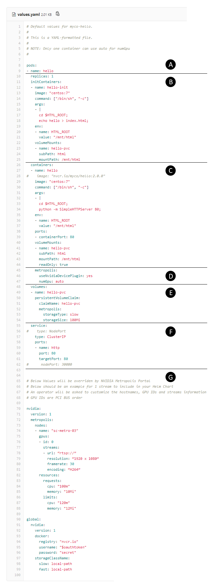

# myco-hello-2.0.0

Helm Chart for MyCo's Hello World sample Helm Chart 2.0.0

## Software Partner Onboarding

One needs only to define the application pods within the values.yaml file – No need to change any template or know any Kubernetes API.

A pod consists of one or more containers.

For now, each pod will be replicated only once per node, in an isolated namespace: &lt;partner name&gt;-&lt;app name&gt;-&lt;node hostname&gt;.

This hello-world example is implementing a simple web server with no real use of any GPU.

Please refer to the following values.yaml sections:

A)	There is only one pod in this example named hello;

B)	A container named hello-init is initially created for adding html/index.html to the shared storage volume defined in section E:

&nbsp;&nbsp;&nbsp;&nbsp;&nbsp; 1.	Volume’s sub-folder html is created and mounted under /mnt/html;

&nbsp;&nbsp;&nbsp;&nbsp;&nbsp; 2.	An environment variable HTML_ROOT is set to /mnt/html;

&nbsp;&nbsp;&nbsp;&nbsp;&nbsp; 3.	The hello-init container adds “hello” to the content of $HTML_ROOT/index.html, then exits;

C)	A container named hello is then created to implement the simple hello-world web server:

&nbsp;&nbsp;&nbsp;&nbsp;&nbsp; NOTE: All final app container images have to come from NGC registry: nvcr.io/isv-&lt;partner name&gt;/&lt;container name&gt;:&lt;container tag&gt;

&nbsp;&nbsp;&nbsp;&nbsp;&nbsp; 1.	Volume’s sub-folder html is mounted read-only under /mnt/html;

&nbsp;&nbsp;&nbsp;&nbsp;&nbsp; 2.	An environment variable HTML_ROOT is set to /mnt/html;

&nbsp;&nbsp;&nbsp;&nbsp;&nbsp; 3.	The hello container runs a simple web server to serve $HTML_ROOT on TCP port 80;

&nbsp;&nbsp;&nbsp;&nbsp;&nbsp; 4.	Port 80 of this container will be exposed through cluster IP on target port 80;

D)	Proprietary container properties are being set:

&nbsp;&nbsp;&nbsp;&nbsp;&nbsp; NOTE: A single container can set metropolis.numGPU to “auto”

&nbsp;&nbsp;&nbsp;&nbsp;&nbsp; 1.	metropolis.useNvidiaDevicePlugin is a Boolean value:

&nbsp;&nbsp;&nbsp;&nbsp;&nbsp;&nbsp;&nbsp;&nbsp;&nbsp;&nbsp; i.	A true value instructs the templates to assign/reserve whole GPUs using Kubernetes’ NVIDIA Device Plugin;

&nbsp;&nbsp;&nbsp;&nbsp;&nbsp;&nbsp;&nbsp;&nbsp;&nbsp;&nbsp; ii.	A false value would instruct templates to assign GPUs using the NVIDIA_VISIBLE_DEVICES environment variable;

&nbsp;&nbsp;&nbsp;&nbsp;&nbsp; 2.	metropolis.numGPU is set to “auto” or a number:

&nbsp;&nbsp;&nbsp;&nbsp;&nbsp;&nbsp;&nbsp;&nbsp;&nbsp;&nbsp; i.	An “auto” value instructs the templates to assign GPUs according to nvidia parameters defined in section G;

&nbsp;&nbsp;&nbsp;&nbsp;&nbsp;&nbsp;&nbsp;&nbsp;&nbsp;&nbsp; ii.	A number >= 0 would instruct the templates to assign a fixed number of GPUs;

E)	This section defines the shared storage volume for POD;

&nbsp;&nbsp;&nbsp;&nbsp;&nbsp; NOTE: The shared volumes are not shared across nodes at this time

F)	This section defines the service type and ports for POD;

G)	This section is generated by NVIDIA Metropolis Portal:

&nbsp;&nbsp;&nbsp;&nbsp;&nbsp; 1.	This section has to include an exmaple for a single node, single stream;

&nbsp;&nbsp;&nbsp;&nbsp;&nbsp; 2.	An operator will be asked to customize hostnames, GPU IDs and streams information;

&nbsp;&nbsp;&nbsp;&nbsp;&nbsp; 3.	GPU IDs are PCI BUS order;

